# 配置

数据库可以对接阿里云的

Django如何对接自己的数据库

数据库的配置在backend/settings中

创建数据库管理员

```bash
python manage.py createsuperuser
```

账号：admin

密码：123

运行Django服务器

```bash
python manage.py runserver
```

静态文件一般放入静态文件夹中，包含图片之类，css文件

static是开发者的文件，用于网站logo等

media是用户的文件，比如用户上传的图片

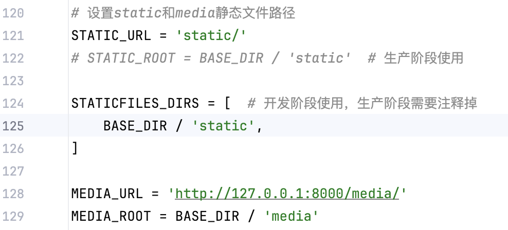


主项目路由backend/urls.py，负责分发路由

它将所有以 `''`（即根路径）开头的请求委托给 web应用的 urls.py模块处理。

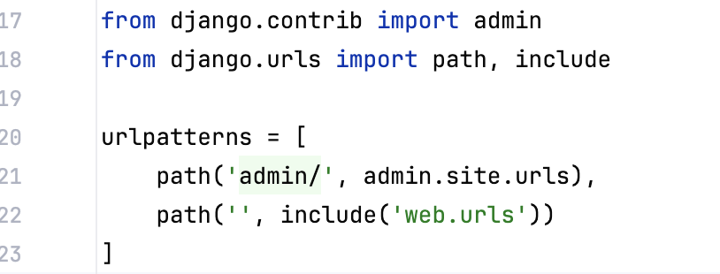

应用级别路由web/urls.py

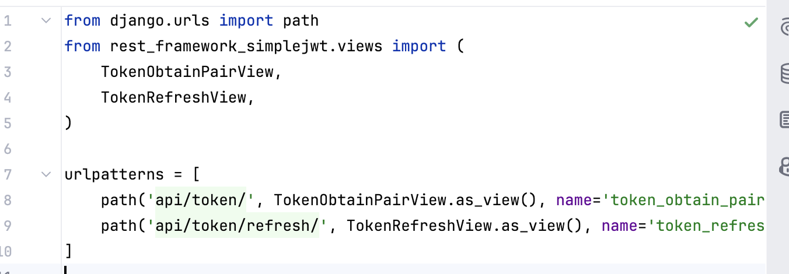

这是 `web` 应用内部的 URL 配置

它定义了两个 JWT 认证相关的 API 路由：

POST /api/token/：获取访问令牌（access token）和刷新令牌（refresh token）

POST /api/token/refresh/：使用刷新令牌获取新的访问令牌。

当用户访问以下 URL 时：

- `http://yourdomain.com/api/token/`
- `http://yourdomain.com/api/token/refresh/`

Django 的 URL 解析流程如下：

1. **主路由匹配**：
   请求路径 `/api/token/` 不匹配 `/admin/`，但匹配 `path('', include('web.urls'))`，于是将剩余路径（即整个 `/api/token/`）交给 `web.urls` 处理。
2. **子路由匹配**：
   在 `web/urls.py` 中，`/api/token/` 正好匹配 `TokenObtainPairView`，从而触发该视图逻辑。

创建前端

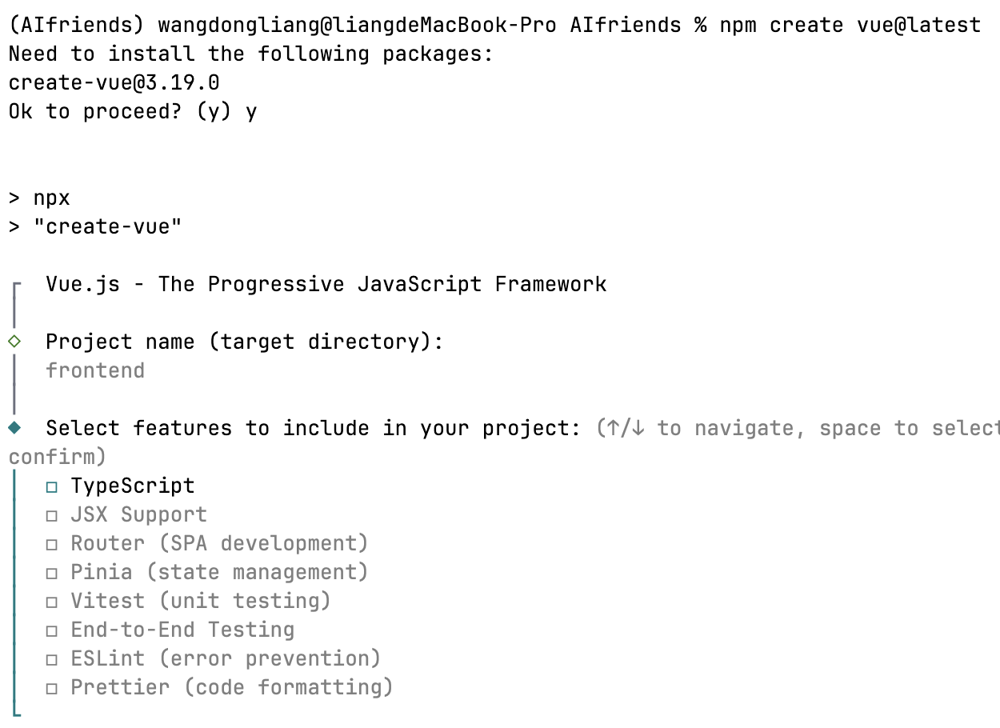

 

在前端文件夹使用npm run build将前端打包到后段
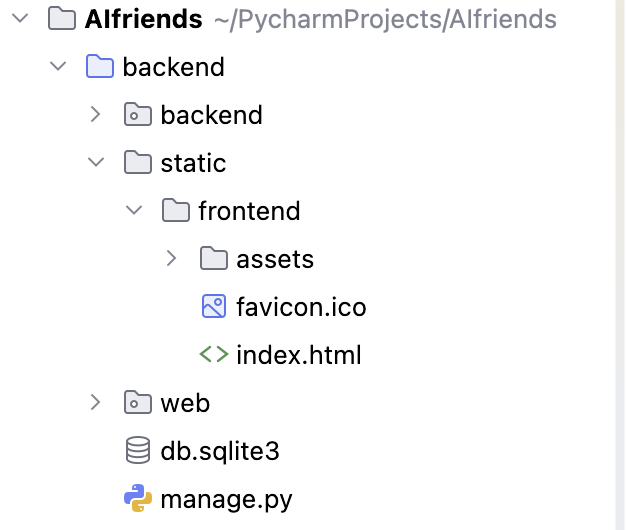

上传代码是上传后段代码，将前端代码打包成css，js等格式

Django定义一个网页需要3个文件，一个html, veiws, url

## 创建前端页面

在web文件夹新建templates文 件夹


新建views软件包（会产生init文件）

url调用函数index，index.py返回index.html页面

三件套，url ，views， html

由url判断路由调用哪个函数，view返回html页面

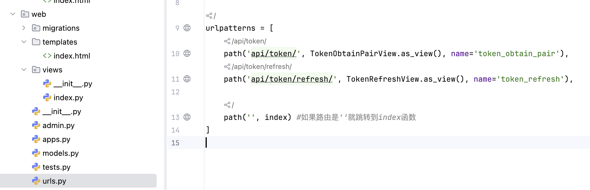

成功将前端页面打包到后端，后段是8000端口，前端是localhost：5173

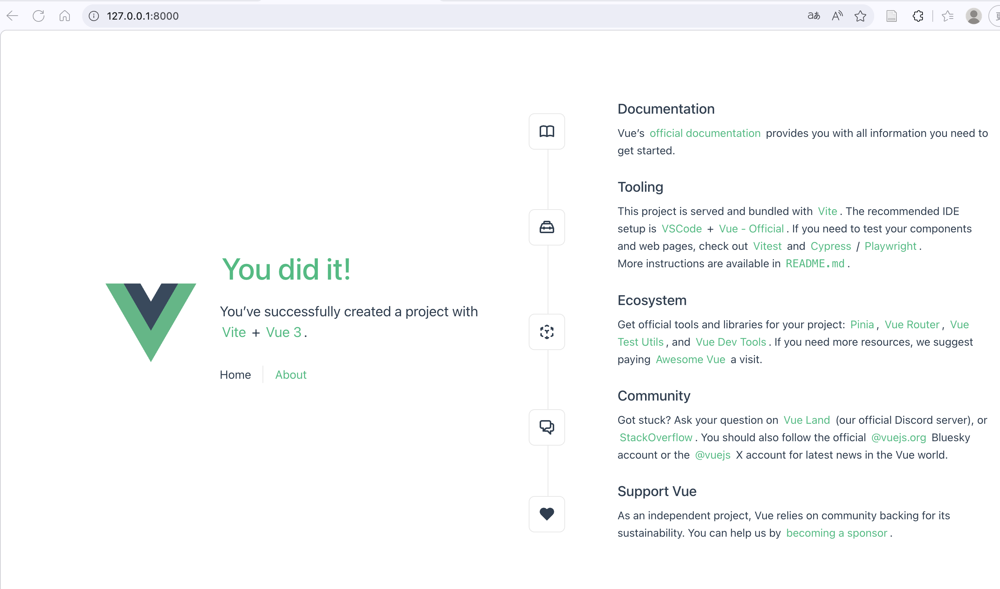

前端运行的命令，在vue3窗口输入npm run dev

## 配置git

生成密钥

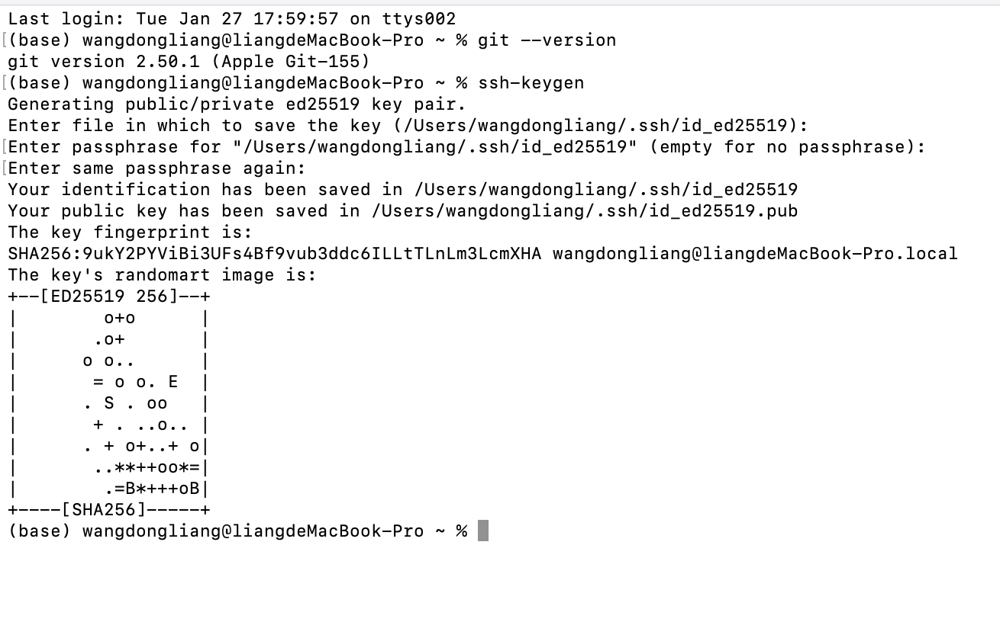

配置.gitignore文件

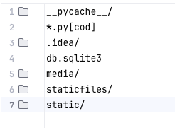

使得上传git的时候避免将敏感内容提交到git上

github创建ssh连接管理见博客[使用SSH key管理认证github](https://blog.csdn.net/m0_69083259/article/details/157906537?spm=1001.2014.3001.5501)


# 前端导航栏创建

前端vue文件

script用于写前端代码， template用于写html，style写jss

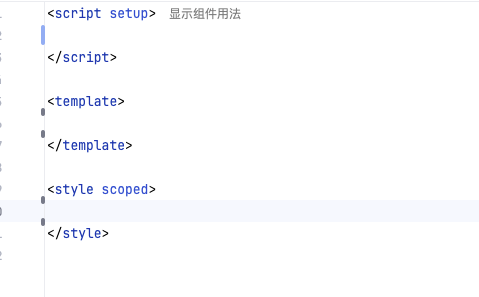

[vue文档](https://cn.vuejs.org/guide/quick-start)

安装tailwind组件

==约定文件夹小写，vue文件用山峰命名法==

在app.vue中引入navbar组件

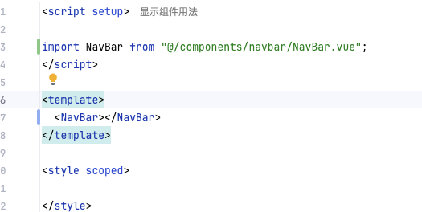

中间的内容会直接填充到NavBar.vue的slot里面

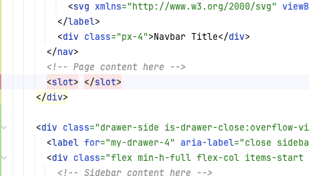

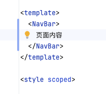


修改标题使用font-bold加粗，text-xl调整字体大小，px-4定义标签和文学的距离

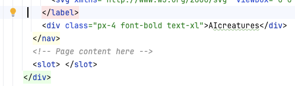

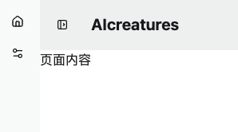

为上方导航栏更改颜色，并添加一条阴影

100数越大越黑，sm调整阴影大小

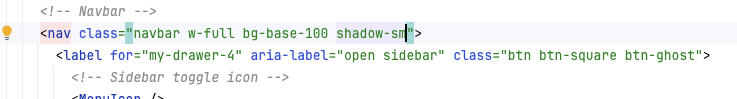

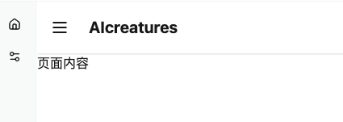

command+shfit+c，可以看见内部元素距离外部元素的距离（padding）

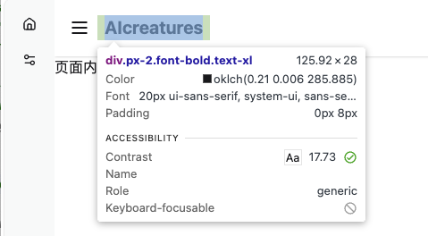

通用在navbar中修改为px-2

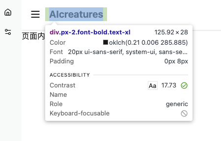

一个元素内部有一个元素的话，那么内部元素距离外部的部分就是padding

如果一个元素外边还有元素，那么这个距离是margin

区分4个方向，left/right/top/bottom

px,py,pt,pb表示padding的4个方向

mx,my,mt,mb表示margin的4个方向

输入下面代码，按tab键直接展开

```vue
div.navbar-center
<div class="navbar-center"></div>
```

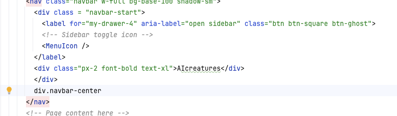

## 对接前后端

```bash
npm eun build
```

运行后代码会直接生成到backend/static里面

修改backend/web/templates/index.html中的js和css文件

运行后段程序查看效果

```bash
python manage.py runserver
```

