# 配置

数据库可以对接阿里云的

Django如何对接自己的数据库

数据库的配置在backend/settings中

创建数据库管理员

```bash
python manage.py createsuperuser
```

账号：admin

密码：123

运行Django服务器

```bash
python manage.py runserver
```

静态文件一般放入静态文件夹中，包含图片之类，css文件

static是开发者的文件，用于网站logo等

media是用户的文件，比如用户上传的图片

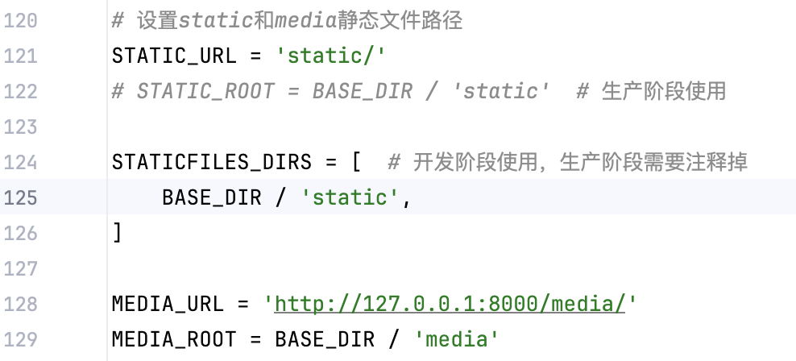


主项目路由backend/urls.py，负责分发路由

它将所有以 `''`（即根路径）开头的请求委托给 web应用的 urls.py模块处理。

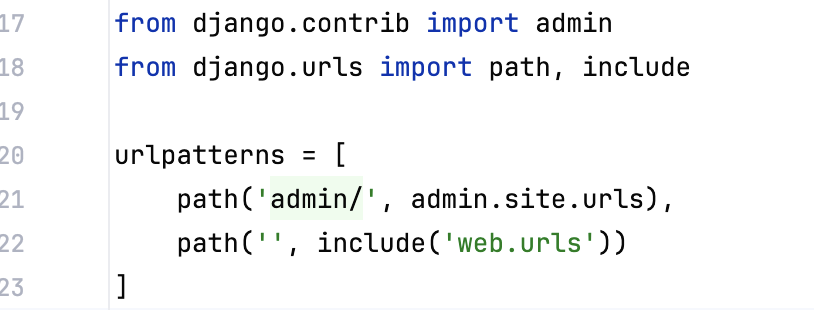

应用级别路由web/urls.py

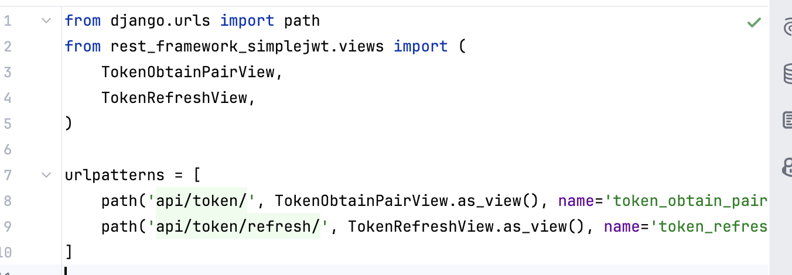

这是 `web` 应用内部的 URL 配置

它定义了两个 JWT 认证相关的 API 路由：

POST /api/token/：获取访问令牌（access token）和刷新令牌（refresh token）

POST /api/token/refresh/：使用刷新令牌获取新的访问令牌。

当用户访问以下 URL 时：

- `http://yourdomain.com/api/token/`
- `http://yourdomain.com/api/token/refresh/`

Django 的 URL 解析流程如下：

1. **主路由匹配**：
   请求路径 `/api/token/` 不匹配 `/admin/`，但匹配 `path('', include('web.urls'))`，于是将剩余路径（即整个 `/api/token/`）交给 `web.urls` 处理。
2. **子路由匹配**：
   在 `web/urls.py` 中，`/api/token/` 正好匹配 `TokenObtainPairView`，从而触发该视图逻辑。

创建前端

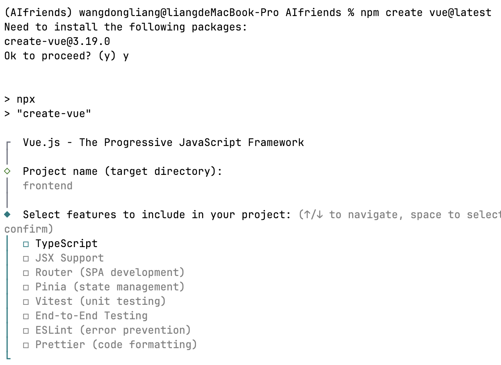

 

在前端文件夹使用npm run build将前端打包到后段
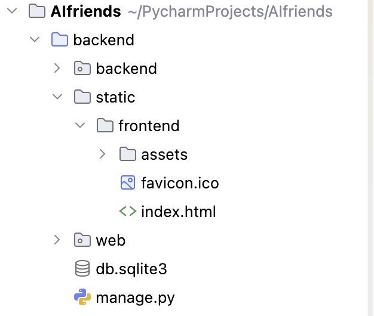

上传代码是上传后段代码，将前端代码打包成css，js等格式

Django定义一个网页需要3个文件，一个html, veiws, url

## 创建前端页面

在web文件夹新建templates文 件夹


新建views软件包（会产生init文件）

url调用函数index，index.py返回index.html页面

三件套，url ，views， html

由url判断路由调用哪个函数，view返回html页面

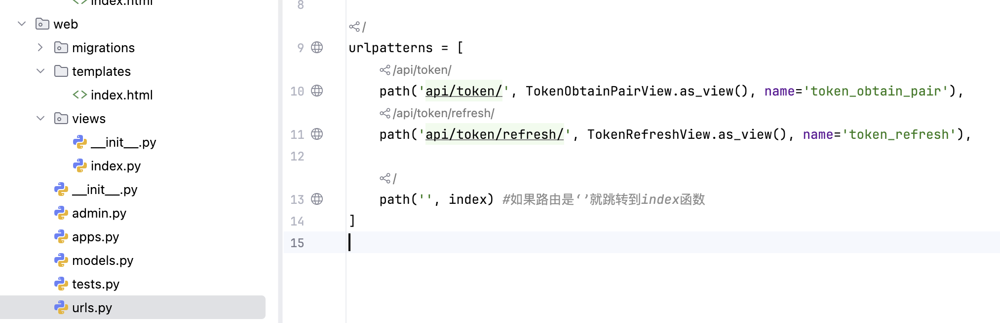

成功将前端页面打包到后端，后段是8000端口，前端是localhost：5173

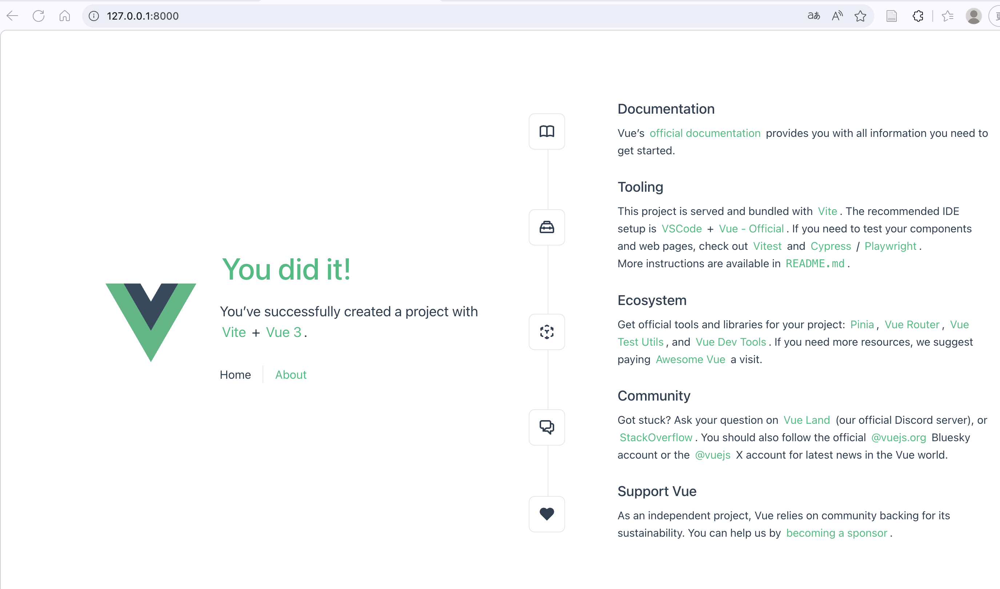

前端运行的命令，在vue3窗口输入npm run dev

## 配置git

生成密钥

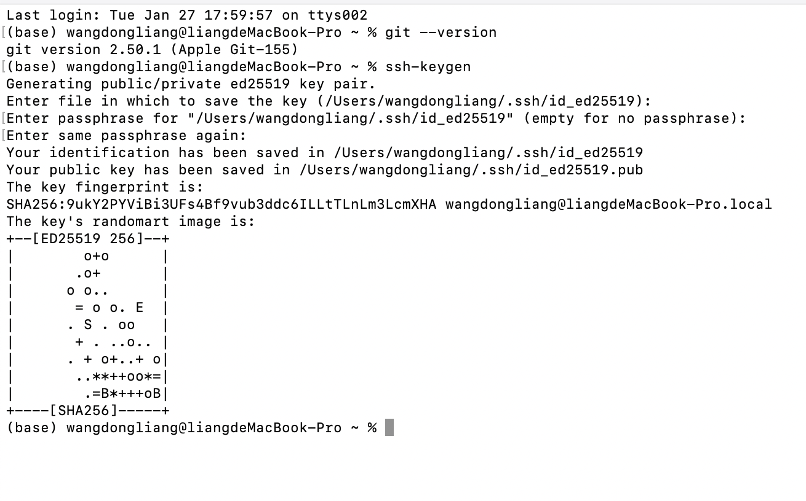

配置.gitignore文件

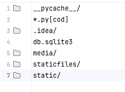

使得上传git的时候避免将敏感内容提交到git上

github创建ssh连接管理见博客[使用SSH key管理认证github](https://blog.csdn.net/m0_69083259/article/details/157906537?spm=1001.2014.3001.5501)


# 前端导航栏创建

前端vue文件

script用于写前端代码， template用于写html，style写jss

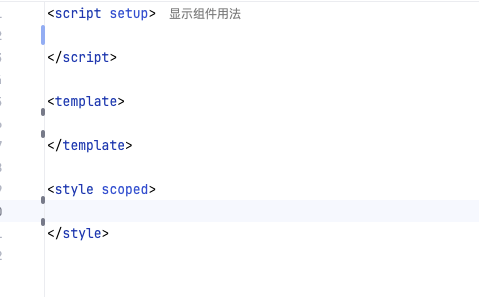

[vue文档](https://cn.vuejs.org/guide/quick-start)

安装tailwind组件

==约定文件夹小写，vue文件用山峰命名法==

在app.vue中引入navbar组件

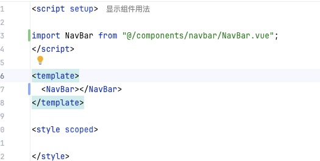

中间的内容会直接填充到NavBar.vue的slot里面

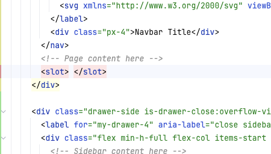

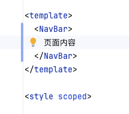


修改标题使用font-bold加粗，text-xl调整字体大小，px-4定义标签和文学的距离

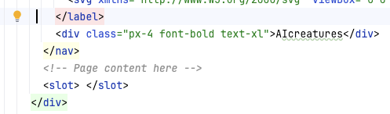

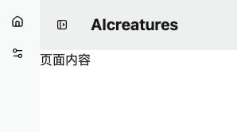

为上方导航栏更改颜色，并添加一条阴影

100数越大越黑，sm调整阴影大小

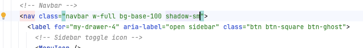

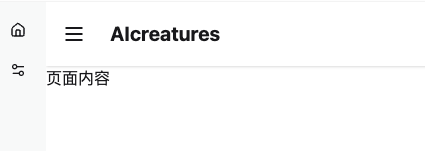

command+shfit+c，可以看见内部元素距离外部元素的距离（padding）

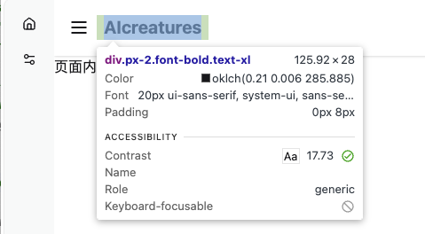

通用在navbar中修改为px-2

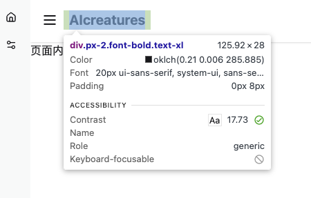

一个元素内部有一个元素的话，那么内部元素距离外部的部分就是padding

如果一个元素外边还有元素，那么这个距离是margin

区分4个方向，left/right/top/bottom

px,py,pt,pb表示padding的4个方向

mx,my,mt,mb表示margin的4个方向

输入下面代码，按tab键直接展开

```vue
div.navbar-center
<div class="navbar-center"></div>
```

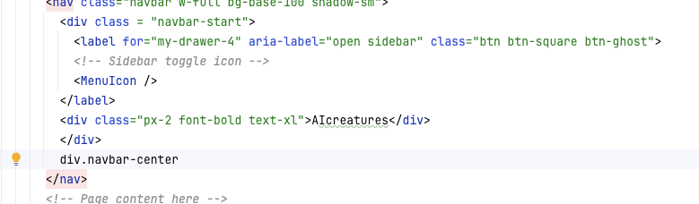

## 对接前后端

```bash
npm eun build
```

运行后代码会直接生成到backend/static里面

修改backend/web/templates/index.html中的js和css文件

运行后段程序查看效果

```bash
python manage.py runserver
```

## 设置导航栏居中，调整紫色边栏居中

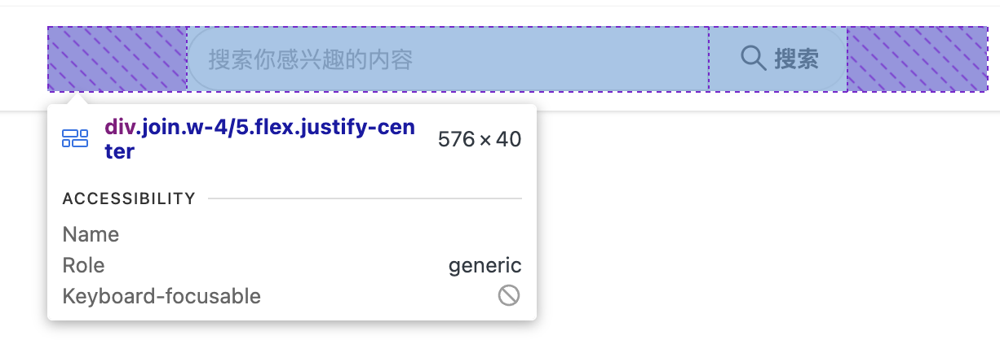

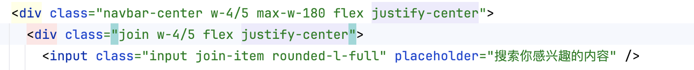

## 一套提交流程

git status查看本地是否有修改

git pull查看云端的代码

git push推送云端

# 登陆模块

配置域名

网站名后面的就是域名

路由在文件frontend/src/router/index.js

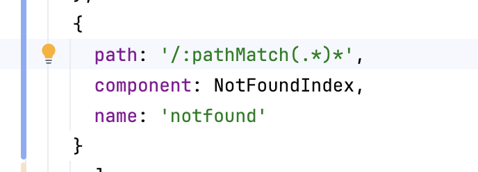

设置兜底路由，从上到下匹配路由，如果都没匹配上就到这个兜底路由

取出user_id变量


动态取出变量user_id

==route用于取出当前url的信息==

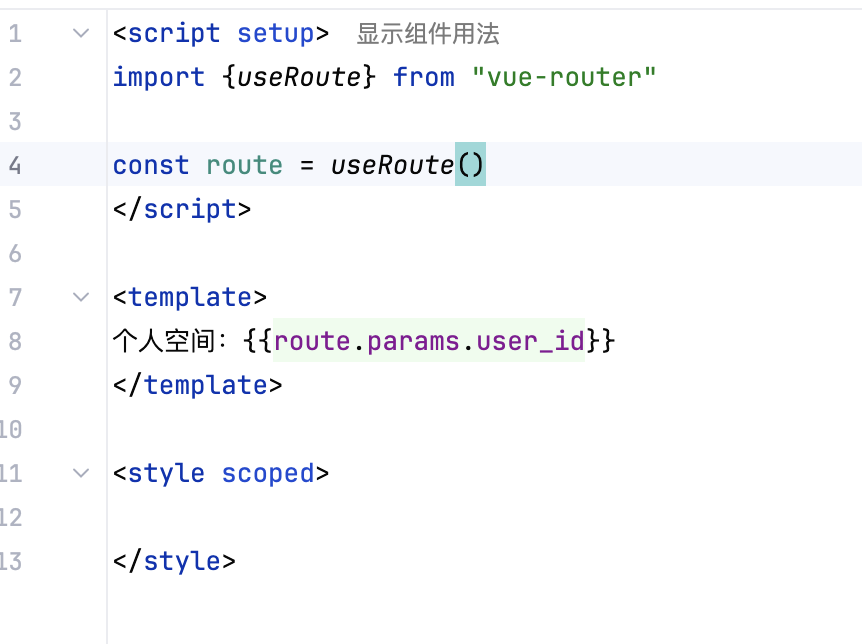

在index.js文件中设置的变量名user_id

```javascript
{
  path: '/user/space/:user_id',
  component: SpaceIndex,
  name: 'user-space-index',
},
```

当访问网址/user/space/123的时候Vue Router 会自动解析成
```javascript
route.params = {
  user_id: "123"
}
```

route  = 我现在在哪
router = 我要去哪


RouterLink修改后点击创作按钮之后，会自动将url改为to后面的页面，之后根据name对应的组件，将组件渲染出来

使用对象路由进行跳转的时候主要to前面要加冒号，否则就会识别为字符串导致路由乱码
Vue Router 查找路由表里 `name` 为 `user-account-login-index` 的那条记录

找到frontend/src/views/user/account/LoginIndex.vue中的组件进行渲染

```vue
<RouterLink :to="{name: 'user-account-login-index'}" class="btn btn-ghost text-lg">
  登陆
</RouterLink>
```

Menu-focus/menu-active实现按钮高亮

实现点击按钮跳转后的高亮，使用active-class，即跳转的router和routerlink里面的一样的话，则自动激活到class中

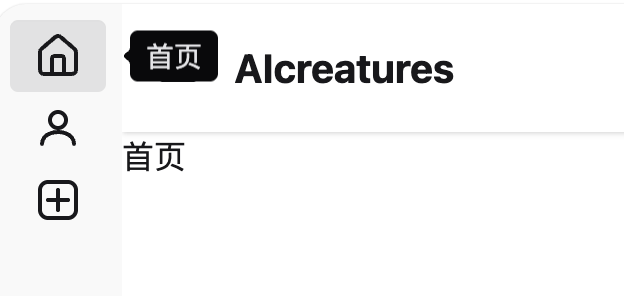

Menu-active效果

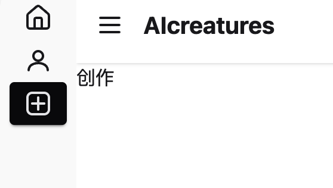

登陆按钮则不太一样是，btn-active

## 登陆界面

实现登陆组件居中方法，放入

```vue
<div class="flex justify-center mt-12">
  登陆组件
</div>
```

这个tag中

使用margin-top设置上边距

后端逻辑

Django后端登陆http://127.0.0.1:8000/admin页面

admin

123

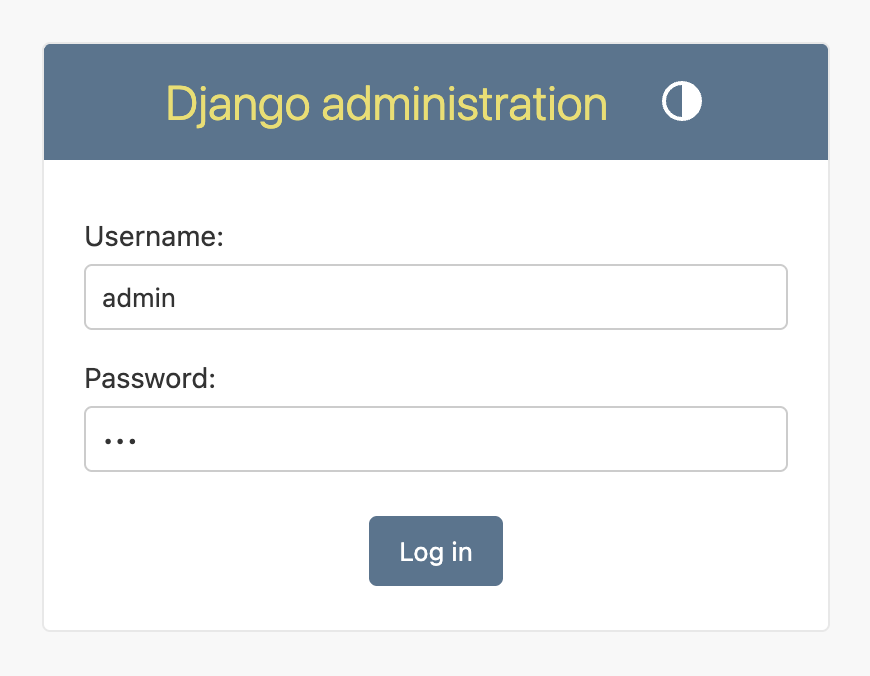

Django创建数据库，在路径backend/models软件包

用户上传的图片都存入backend/media文件夹

开发者相关的图片放入static中

自定义文件上传路径

```python
def photo_upload_to(instance, filename):
  ext = filename.split('.')[-1] # 获取文件的后缀名
  filename = f'{uuid.uuid4().hex[:10]}.{ext}'
  return f'user/photo/{instance.user_id}_{filename}'
```

instance是User Profile的一个对象，filename为用户上传的原始文件名

spilt('.')字符串方法，用于按照符号.分割为一个列表，如果如果文件名是 `vacation.photo.png`，分割后变成 `['vacation', 'photo', 'png']`其中的[-1]代表倒序索引。即获取列表的最后一个元素，也就是文件的后缀，存入变量ext

这里使用了 f-string (格式化字符串)，大括号 `{}` 里的内容会被计算并填入字符串中。uuid.uuid4()生成一个随机的唯一的标识符号，hex方法将它转换为16进制字符串`[:10]`**: **切片操作。只截取前 10 位字符,10位随机数已经可以保证一个用户文件夹下不重复，**`.{ext}`**: 把刚才提取的后缀拼回去。


python manage.py makemigrations生成数据库更新操作

python manage.py migrate将数据库的更新同步到db.sqlite3

将之前定义的 `UserProfile` 模型注册到 **Django Admin（后台管理系统）** 中，以便你能在网页界面上直接增删改查用户信息。

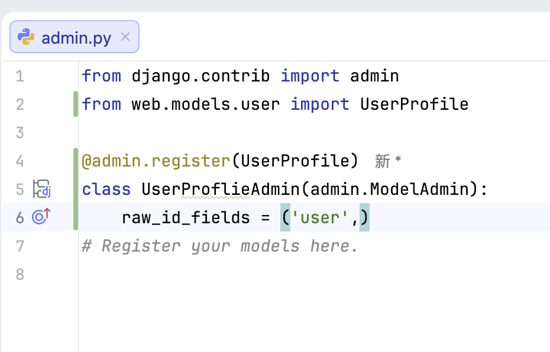

`UserProfile` 关联了 `User`（用户表）。默认情况下，Django 后台会把所有用户放在一个**下拉列表（Select）**里。如果你的网站有 10 万个用户，后台加载编辑页面时，Django 会尝试把 10 万个用户全部读进内存来渲染那个下拉框，这会导致**页面加载极其缓慢甚至崩溃**。

**解决方案（raw_id_fields）**：

它把下拉列表变成了**一个输入框**。旁边会有一个**放大镜图标**。点击后会弹出一个小窗口让你搜索用户。找到用户后，它只把用户的 `ID`（一个数字）填回输入框。

**结论**：这是处理大数据量关联关系时的**性能优化**必备手段。

使用默认的方法，raw_id_fields = []

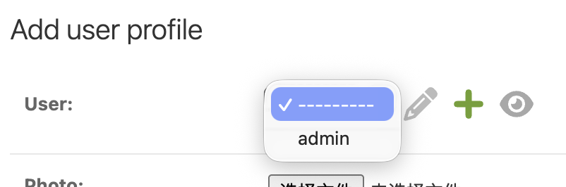


实现4个api

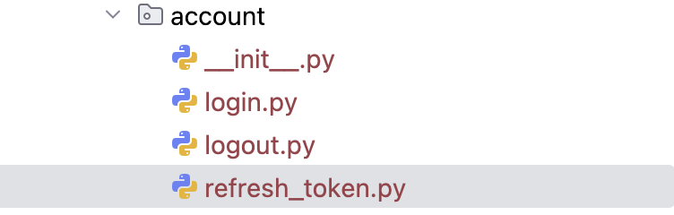

admin页面是django自带的登陆方式

jwt（json web token）登陆方式比较时兴

主要包含两个token

1.refresh token，主要用于刷新access，有效期7天，存入cookie中。前端代码无法访问，后段可以进行设置维护

2.access token身份验证token，有效期2小时，存入内存，前端js变量中


登陆实现

一般只获取信息就是get请求，其余都是post请求

post的信息在data中，data是一个字典，可以用get方法，也可以用数组方法

strip()方法用于删除字符串前后空格

```python
user = authenticate(username=username, password=password)
```

验证用户名和密码是否匹配，==如果匹配会返回用户名对应的用户，否则返回为空==

Userprofile是刚才定义的数据库，object表示，==get就是获取一个数据，如果没有数据或者多于一个数据就会爆异常==，由于用户名唯一所以只能获取一个数据。总体就是查询用户名为username的数据，

生成refreshtoken，并将accesstoken返回给用户

用户名username是在数据库user中

用户的照片和信息在userprofile中

photo后面加url才能转换为路径

将refreshtoken放入cookie中，refresh就是refreshtoken，refres.access_token就是accesstoken

**为什么要设置两个类？user和userprofile是怎么联系到一起的？**

user表是Django自带的，在Django中这种设计模式称为用户模型扩展，主要有以下原因

1.职责分离，Django自带的类user非常强大，它内置了权限管理，密码加密和登陆逻辑，它只包含基础字段（用户名、邮箱、密码）。如果你想存用户的**头像、手机号、家庭住址、座右铭**，这些字段并不属于“核心账号信息”，放在自定义的UserProfile中更整洁。

2.保护核心系统，直接修改 Django 的源码或强制继承并修改核心 User类风险较高。通过外挂一个 UserProfile，你可以在不破坏 Django 登录逻辑的前提下，随意添加业务字段。

3.数据库性能，如果用户信息非常多，分在两个表中，可以使核心认证操作速度更快

在Django中通常使用OneToOneField一对一外键建立联系，在web/models/user.py

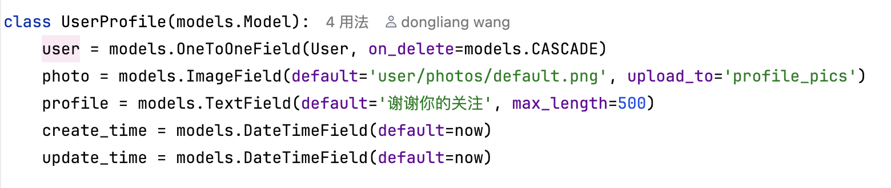

OneToOneField代表一个user只能对应一个userprofile

on_delete=models.CASCADE：级联删除。如果这个用户账号被删除了，他的个人资料（头像等）也会跟着被自动删除，不会留下垃圾数据。

在 Django REST Framework (DRF) 中，这个 request是 rest_framework.request.Request类的实例。里面装满了前端传给后端的所有信息。

**退出登陆**

```python
permission_classes = [IsAuthenticated] # 强制登陆才能访问
```

如果没有登陆会返回401，django内置逻辑


python中如果是空字符串的话，not之后就是true

每次用refresh去刷新access的时候，refresh自身也会被刷新，'ROTATE_REFRESH_TOKENS': True的含义

在settings.py中

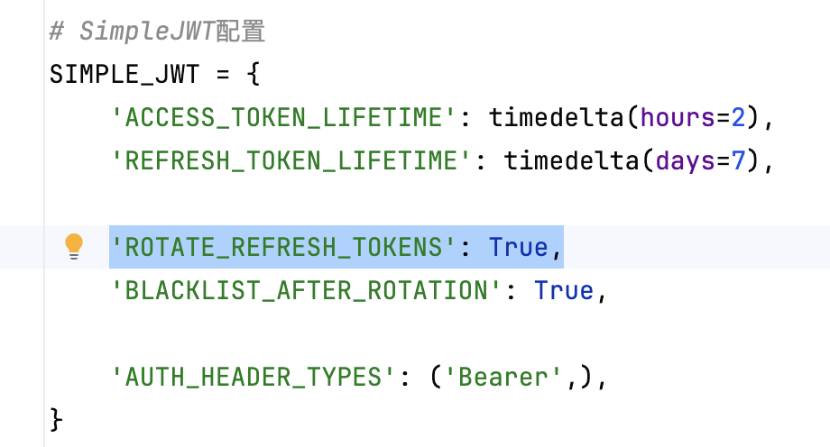

注意cookie里存入的refresh（保存时间更长），返回给前端的是access


前端路由和后端路由的区别

前端路由就是在地址栏里切换

后端路由是决定调用哪个api

路由前面加一个api防止和前端路由冲突，注意引入包，是自己写的view函数

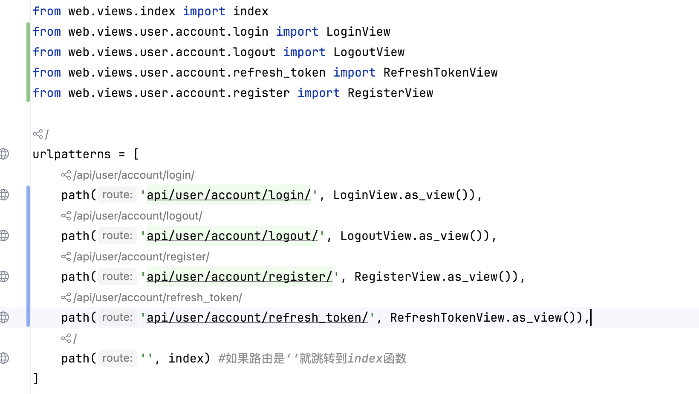
